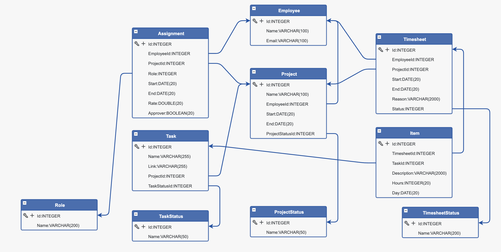
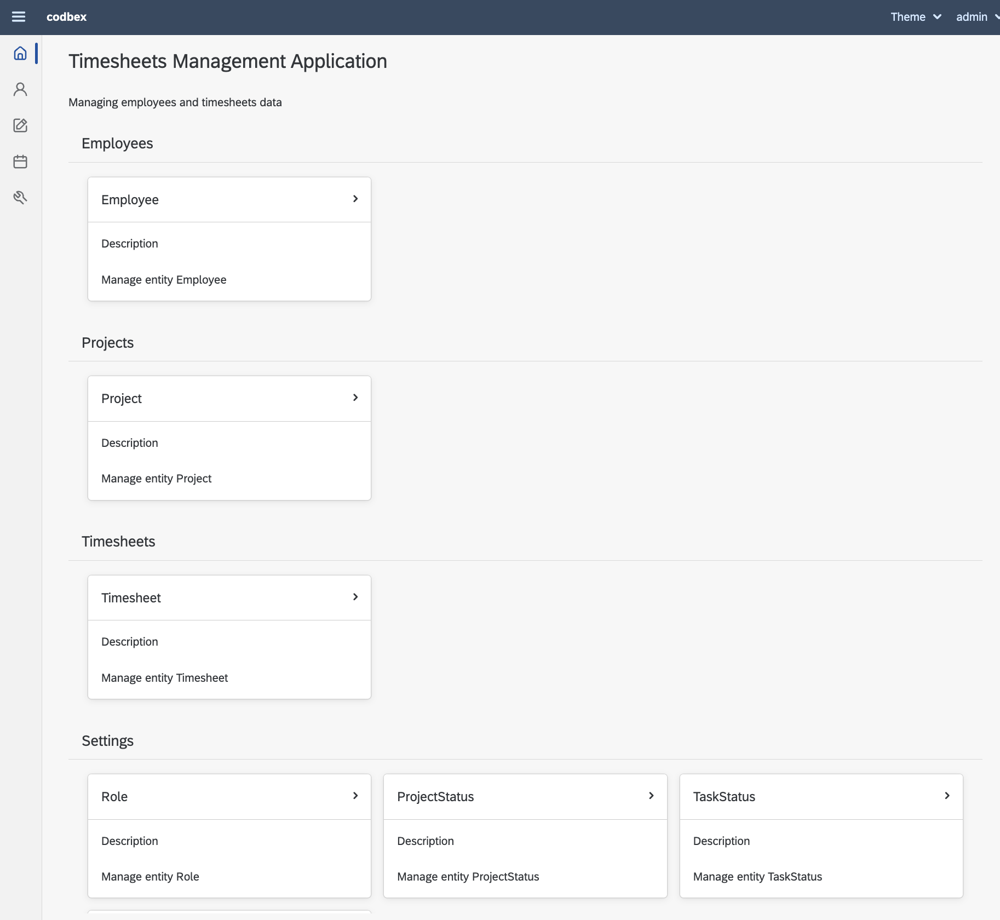
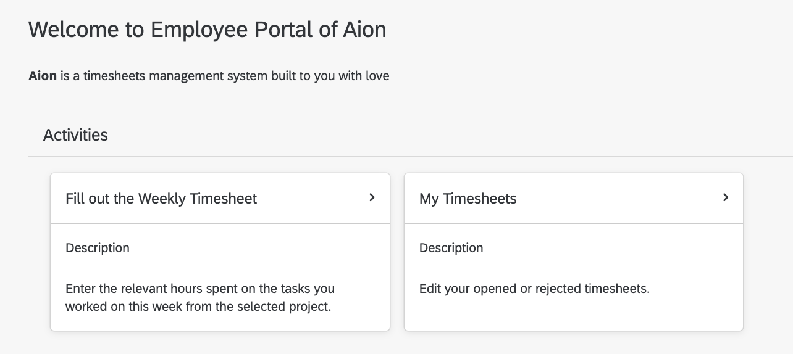
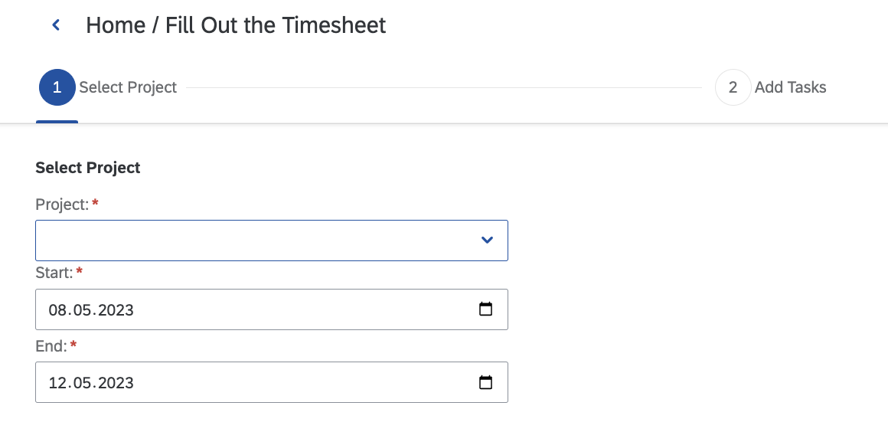
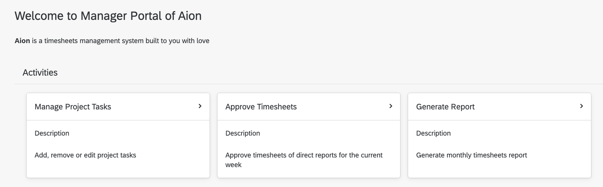
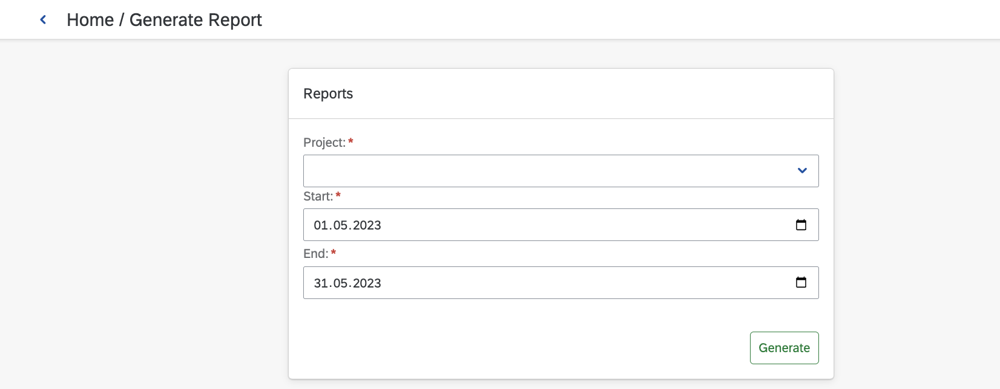

# codbex-aion

Timesheets Management Application

## Access Points

- [{host}/services/web/ide/](http://localhost:8080/services/web/ide/) - Web IDE
- [{host}/services/web/codbex-aion/gen/](http://localhost:8080/services/web/codbex-aion/gen/) - Admin Panel
- [{host}/services/web/codbex-aion-ext/ui/employee/](http://localhost:8080/services/web/codbex-aion-ext/ui/employee/) - Employee Dashboard
- [{host}/services/web/codbex-aion-ext/ui/manager/](http://localhost:8080/services/web/codbex-aion-ext/ui/manager/) - Manager Dashboard

## Model



## Administrative Application



## Employee Portal



## Employee Fill-out Timesheet



## Manager Portal



## Manager Generate Report



## Users & Roles

For local test & development use the following `tomcat-users.xml`:
```xml
<tomcat-users>
    <role rolename="Everyone"/>
    <role rolename="Developer"/>
    <role rolename="Operator"/>

    <role rolename="Admin"/>
    <role rolename="Manager"/>
    <role rolename="Employee"/>

    <user username="dirigible" password="dirigible" roles="Developer,Operator,Everyone,Manager,Employee,Admin"/>

    <user username="admin" password="admin" roles="Admin,Everyone"/>

    <user username="manager@codbex.com" password="manager" roles="Manager,Everyone"/>
    <user username="developer@codbex.com" password="developer" roles="Employee,Everyone"/>
    <user username="developer2@codbex.com" password="developer" roles="Employee,Everyone"/>
    <user username="developer3@codbex.com" password="developer" roles="Employee,Everyone"/>
</tomcat-users>
```

The `codbex-aion` application roles are:
- Employee
- Manager
- Admin

The `Eclipse Dirigible` roles are:
- Developer
- Operator

The `Everyone` role should be assigned to each user.
